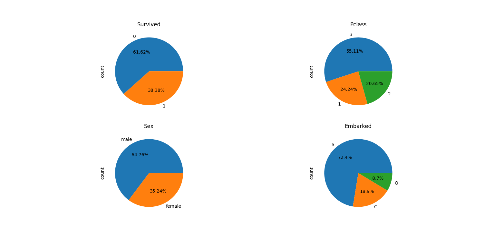
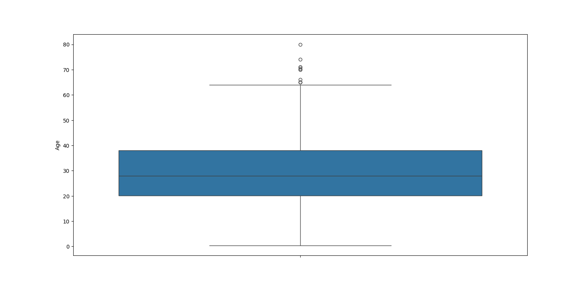
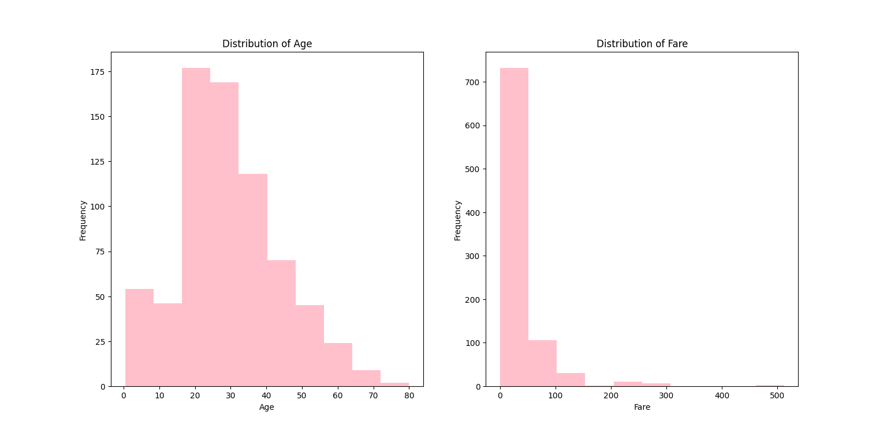

# Titanic Dataset Analysis

## Overview

This project involves analyzing the Titanic dataset to perform data preprocessing, feature encoding, and exploratory data analysis. The dataset includes various features related to passengers, and the goal is to prepare the data for further analysis or machine learning.

## Dataset

The dataset used is `Titanic-Dataset.csv`, which contains the following columns:
- `PassengerId`
- `Pclass`
- `Name`
- `Sex`
- `Age`
- `SibSp`
- `Parch`
- `Ticket`
- `Fare`
- `Cabin`
- `Embarked`

## Requirements

- Python 3.x
- Pandas
- NumPy
- Matplotlib
- Seaborn

You can install the required packages using pip:

```bash
pip install pandas numpy matplotlib seaborn
```

## Usage

1. **Load the Data**

   Load the dataset into a Pandas DataFrame:

   ```python
   import pandas as pd

   # Load the dataset
   data = pd.read_csv('Titanic-Dataset.csv')
   ```

2. **Preprocessing**

   - **Handle Missing Values:**

     ```python
     # Fill missing 'Age' values with the median age
     data['Age'] = data['Age'].fillna(data['Age'].median())

     # Fill missing 'Embarked' values with the most frequent value
     if 'Embarked' in data.columns:
         most_frequent_embarked = data['Embarked'].mode()[0]
         data['Embarked'] = data['Embarked'].fillna(most_frequent_embarked)
     ```

   - **Convert Categorical Features:**

     ```python
     # Convert 'Cabin' to binary
     data['Cabin'] = data['Cabin'].apply(lambda x: 0 if pd.isna(x) else 1)

     # Check for the presence of categorical columns
     if 'Sex' in data.columns and 'Embarked' in data.columns:
         # Create dummy variables for 'Sex' and 'Embarked'
         dummies = pd.get_dummies(data[['Sex', 'Embarked']], drop_first=True)

         # Concatenate the dummy variables with the original DataFrame
         data = pd.concat([data, dummies], axis=1)

         # Drop the original categorical columns
         data = data.drop(['Sex', 'Embarked'], axis=1)
     ```

3. **Exploratory Data Analysis**

   - **Visualizations:**

     ```python
     import matplotlib.pyplot as plt
     import seaborn as sns

     # Create subplots
     fig, axs = plt.subplots(2, 2, figsize=(15, 10))

     # Example plots
     sns.histplot(data['Age'], kde=True, ax=axs[0, 0]).set(title='Age Distribution')
     sns.countplot(data=data, x='Pclass', ax=axs[0, 1]).set(title='Passenger Class Distribution')
     sns.countplot(data=data, x='Survived', hue='Pclass', ax=axs[1, 0]).set(title='Survival by Pclass')
     sns.boxplot(data=data, x='Pclass', y='Fare', ax=axs[1, 1]).set(title='Fare by Pclass')

     plt.tight_layout()
     plt.show()
     ```

## Output

- **Preprocessed Data:**

  The DataFrame `data` will contain the preprocessed features and encoded categorical variables.

- **Plots:**

  The generated plots will help visualize the distribution of various features and their relationships.

### Pie Charts of Passenger Categories



### Boxplot of Passenger Ages



### Count Plots of Passengers by Survival, Pclass, and Survival/Pclass Combination


### Histograms of Age and Fare Distributions




## Notes

- Ensure that the dataset file `Titanic-Dataset.csv` is in the same directory as your script or provide the correct path.
- Modify and add more analysis or visualizations as needed.

## License

This project is licensed under the MIT License. See the [LICENSE](LICENSE) file for more details.

---
