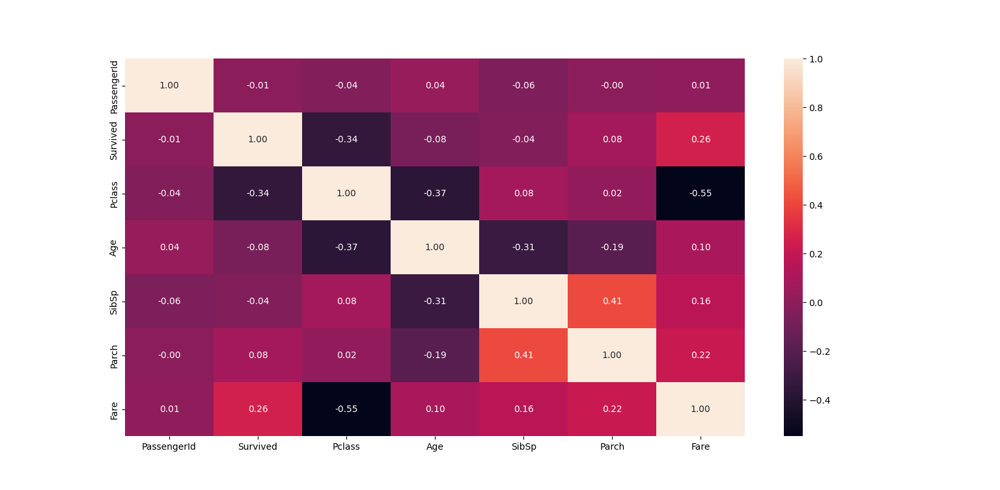
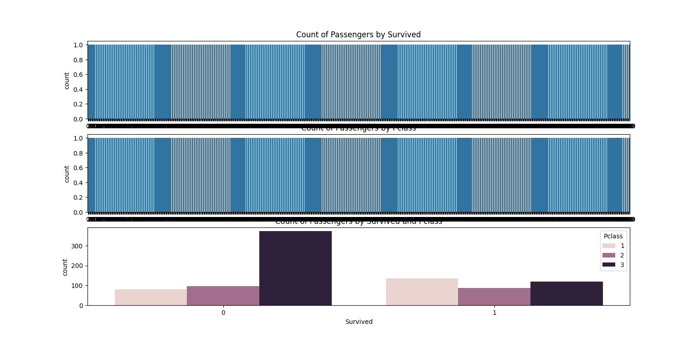
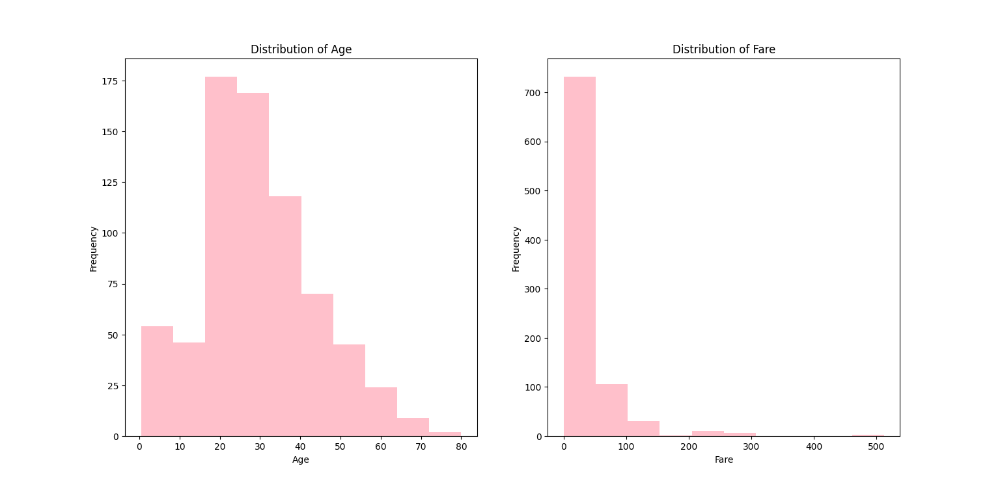

## Result

- **Preprocessed Data:**

  The DataFrame `data` will contain the preprocessed features and encoded categorical variables.

- **Plots:**

  The generated plots will help visualize the distribution of various features and their relationships.

  ### Pie Charts of Passenger Categories

  ### Correlation Heatmap

  ### Boxplot of Passenger Ages

  ### Count Plots of Passengers by Survival, Pclass, and Survival/Pclass Combination

  ### Histograms of Age and Fare Distributions

