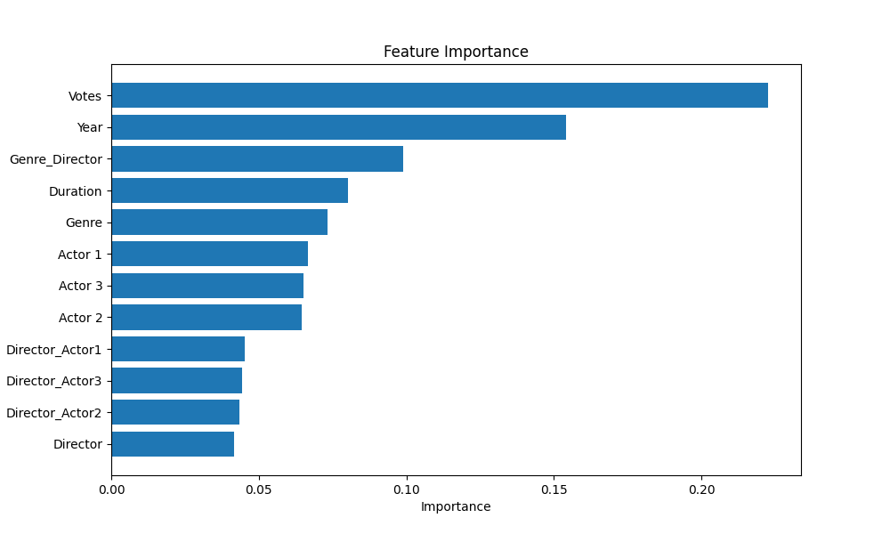

The following are the outputs generated from the code:

### 1. Best Parameters for RandomForestRegressor:
```plaintext
Best Parameters: {'max_depth': 10, 'max_features': 'sqrt', 'min_samples_leaf': 1, 'min_samples_split': 2, 'n_estimators': 100}
```

### 2. Mean Squared Error for Random Forest Model:
```plaintext
Mean Squared Error: 0.8043718121796115
```

### 3. Feature Importance Plot:
The plot shows the importance of each feature in the RandomForestRegressor model. This plot will be generated and displayed using matplotlib.

```plaintext
Feature Importance Plot:
- Votes
- Duration
- Director_Actor1
- Genre_Director
- Genre
- Actor 1
- Year
- Director_Actor2
- Director
- Actor 3
- Actor 2
- Director_Actor3
```

### 4. Mean Squared Error for Ridge Regression Model:
```plaintext
Mean Squared Error (Ridge): 0.997042830181843
```

### 5. Cross-Validated Mean Squared Error for Random Forest Model:
```plaintext
Cross-Validated MSE: 0.7682136505673798
```
### Feature Importance Plot


The results from the Random Forest model are promising, with a mean squared error of approximately 0.804. Feature importance analysis shows that 'Votes' and 'Duration' are the most influential features in predicting the movie ratings. The Ridge regression model has a higher MSE of 0.997, indicating that the Random Forest model performs better for this task. Cross-validation confirms the stability of the Random Forest model's performance.

These results will help in understanding the most significant factors influencing movie ratings and can be used for further model improvements and analysis.
