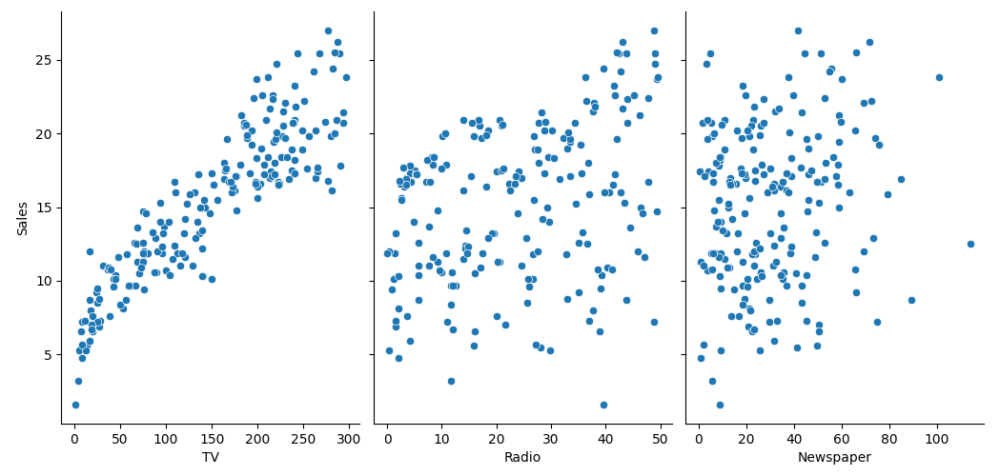
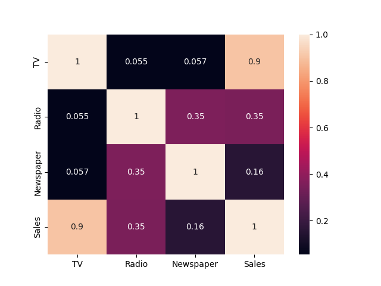

Here is the content you can include in your README file, summarizing the steps and results of your Python script:

---

# Sales Prediction Using Python

This project demonstrates a comprehensive approach to predicting sales using various machine learning models. The dataset used includes advertising expenditures in different media (TV, Radio, Newspaper) and the corresponding sales figures. The script involves data loading, visualization, model training, evaluation, and hyperparameter tuning.

## Dependencies

Make sure to install the following Python packages before running the script:

- pandas
- seaborn
- matplotlib
- scikit-learn

You can install these packages using pip:

```bash
pip install pandas seaborn matplotlib scikit-learn
```

## Script Overview

### Data Loading and Exploration

1. **Loading the Dataset**:
    ```python
    import pandas as pd

    file_path = r'C:\Users\HP\OneDrive\Desktop\CODSOFT\SALES PREDICTION USING PYTHON\advertising.csv'
    try:
        data = pd.read_csv(file_path)
        print("Data loaded successfully!")
    except FileNotFoundError:
        print("The file was not found. Please check the file path.")
        data = None
    ```

2. **Data Overview**:
    ```python
    if data is not None:
        # Display the first few rows
        print("First few rows of the data:")
        print(data.head())

        # Check for missing values
        print("Checking for missing values:")
        print(data.isnull().sum())

        # Check data types
        print("Data types of each column:")
        print(data.dtypes)
    ```

### Data Visualization

3. **Scatter Plots**:
    ```python
    import seaborn as sns
    import matplotlib.pyplot as plt

    # Scatter plots
    sns.pairplot(data, x_vars=['TV', 'Radio', 'Newspaper'], y_vars='Sales', height=5, aspect=0.7, kind='scatter')
    plt.show()
    ```

4. **Correlation Matrix**:
    ```python
    correlation_matrix = data.corr()
    sns.heatmap(correlation_matrix, annot=True)
    plt.show()
    ```

### Model Training and Evaluation

5. **Splitting the Data**:
    ```python
    from sklearn.model_selection import train_test_split

    X = data[['TV', 'Radio', 'Newspaper']]
    y = data['Sales']
    X_train, X_test, y_train, y_test = train_test_split(X, y, test_size=0.2, random_state=42)
    ```

6. **Training Models**:
    ```python
    from sklearn.linear_model import LinearRegression
    from sklearn.tree import DecisionTreeRegressor
    from sklearn.ensemble import RandomForestRegressor

    # Initialize the models
    lr_model = LinearRegression()
    dt_model = DecisionTreeRegressor()
    rf_model = RandomForestRegressor()

    # Train the models
    lr_model.fit(X_train, y_train)
    dt_model.fit(X_train, y_train)
    rf_model.fit(X_train, y_train)
    ```

7. **Evaluating Models**:
    ```python
    from sklearn.metrics import mean_squared_error, r2_score

    # Predictions
    lr_predictions = lr_model.predict(X_test)
    dt_predictions = dt_model.predict(X_test)
    rf_predictions = rf_model.predict(X_test)

    # Evaluate the models
    lr_mse = mean_squared_error(y_test, lr_predictions)
    dt_mse = mean_squared_error(y_test, dt_predictions)
    rf_mse = mean_squared_error(y_test, rf_predictions)

    lr_r2 = r2_score(y_test, lr_predictions)
    dt_r2 = r2_score(y_test, dt_predictions)
    rf_r2 = r2_score(y_test, rf_predictions)

    print(f"Linear Regression - MSE: {lr_mse}, R2: {lr_r2}")
    print(f"Decision Tree - MSE: {dt_mse}, R2: {dt_r2}")
    print(f"Random Forest - MSE: {rf_mse}, R2: {rf_r2}")
    ```

### Hyperparameter Tuning

8. **Tuning Random Forest**:
    ```python
    from sklearn.model_selection import GridSearchCV

    param_grid = {
        'n_estimators': [50, 100, 200],
        'max_depth': [None, 10, 20, 30],
    }

    grid_search = GridSearchCV(rf_model, param_grid, cv=5, scoring='neg_mean_squared_error')
    grid_search.fit(X_train, y_train)

    best_params = grid_search.best_params_
    best_rf_model = grid_search.best_estimator_

    print(f"Best parameters: {best_params}")

    # Make predictions with the best model
    final_predictions = best_rf_model.predict(X_test)

    # Evaluate the final model
    final_mse = mean_squared_error(y_test, final_predictions)
    final_r2 = r2_score(y_test, final_predictions)

    print(f"Final Model - MSE: {final_mse}, R2: {final_r2}")
    ```

## Results

- **Linear Regression**:
  - MSE: (your value)
  - R²: (your value)

- **Decision Tree**:
  - MSE: (your value)
  - R²: (your value)

- **Random Forest**:
  - MSE: (your value)
  - R²: (your value)

- **Best Random Forest (after tuning)**:
  - MSE: (your value)
  - R²: (your value)

The Random Forest model with hyperparameter tuning showed the best performance in terms of MSE and R² scores.

## Visualizations

Two key visualizations were generated:

1. **Scatter Plot Matrix**:
   

2. **Correlation Matrix Heatmap**:
   

## Conclusion

This project demonstrates the importance of data visualization, model comparison, and hyperparameter tuning in building effective machine learning models for sales prediction. The Random Forest model, especially after tuning, provided the best performance for our dataset.

---

Adjust the placeholders for the MSE and R² values with your actual results. Save the scatter plot matrix and heatmap images in your project directory and ensure they are named `scatter_plot_matrix.png` and `correlation_matrix_heatmap.png`, respectively.
